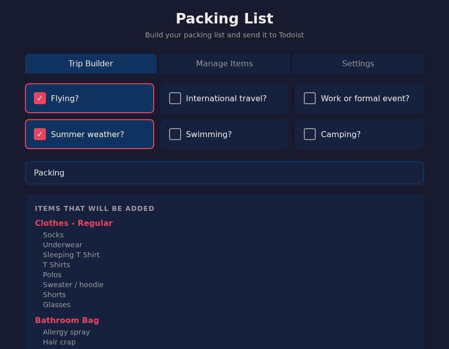

# Packing List

A lightweight web app that builds a filtered packing list based on your trip type and sends it to [Todoist](https://todoist.com) as a nested task.



## Features

- Answer a few questions about your trip (flying? camping? summer?) and only relevant items are included
- Send directly to your Todoist inbox with one click
- Edit categories and items in the browser — no JSON editing required
- Enter your Todoist API key in the Settings tab — no config files to touch

## Requirements

- Python 3 (no external packages — uses standard library only)
- A [Todoist](https://todoist.com) account

## Setup

```bash
git clone git@github.com:tommertron/packingList.git
cd packingList
pip install -r requirements.txt
python3 server.py
```

Then open [http://localhost:8420](http://localhost:8420) in your browser.

## First-time configuration

1. Go to the **Settings** tab
2. Paste your Todoist API key (get it from [Todoist → Settings → Integrations → Developer](https://app.todoist.com/app/settings/integrations/developer))
3. Click **Save**

Your packing list is stored in `packing.json` (gitignored). On first run it falls back to `packing.template.json`. Customize it via the **Manage Items** tab.

## Usage

1. Open the **Trip Builder** tab
2. Check which conditions apply to your trip
3. Name your Todoist task (defaults to "Packing")
4. Click **Send to Todoist**

## Optional: run on a custom port

```bash
python3 server.py 9000
```
